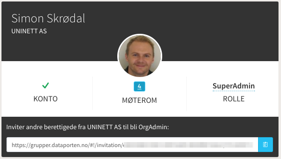
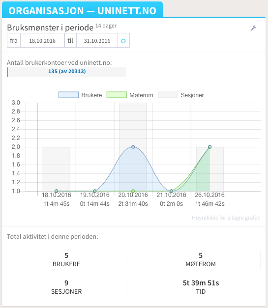
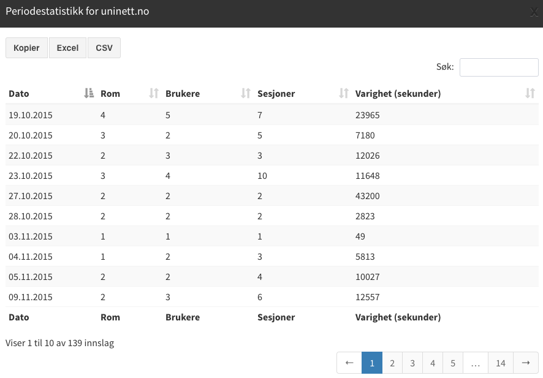

# (Adobe)Connect Admin

*Note: This client is developed by UNINETT AS and is tailor-made to suit higher education in Norway. 
It uses in-house developed APIs pertaining to a specific use-case and relies heavily on UNINETT Dataporten (for OAuth). 
Dependencies also require access to a self-hosted instance of Adobe Connect.* 

Access to the client, regardless of user role, is enforced by Dataporten auth.

## Info 

ConnectAdmin is a single-page web client that provides information views pertaining to 

- user
- organisation 
- global (service)

Information displayed in the views are dictated by the user's role in the system, which will be one of the following:

- `SuperAdmin`: UNINETT employee
- `OrgAdmin`: Member of Dataporten Ad-hoc Group for the service
- `Guest`: No extra privileges

### View: User

A section displaying logged on user's account details in Adobe Connect:

- Has account
- List of meeting rooms pertaining to the account
- Role in the service (`SuperAdmin` or `OrgAdmin` or `Guest`)

**Roles `SuperAdmin` or `OrgAdmin`:**

If logged on user has an elevated role they will also be able to invite other users at their home org to get the role of `OrgAdmin`.  

### View: Organisation

The organisation view allows the logged on user to retrieve and observe Adobe Connect usage information for his/her home organisation (within defined time periods).

 **Role `OrgAdmin`:**
 
 Elevated users may also export (by means of print, copy, Excel, CSV):  
 
 - the statistical information displayed in the chart
 - complete listing of all users at their home org
 
 
 
 **Role `SuperAdmin`:**
 
 Further to the privileges of the `OrgAdmin`, the `SuperAdmin` may also list/export all subscribing orgs and view/export stats/users pertaining to each org. 
   
### View: Global (service)
   
The Global view is very similar to the Organisation view, but presents global stats rather than info pertaining to any one organisation. This view is accessible to all roles.   
   
## Requirements
 
The client
 
- must be registered in Dataporten in order to get the required `Client ID` and `Client Secret` 
- requires Dataporten scopes `groups` `profile` `userid` `userid-feide`
- must request access to the [`Adobe Connect Web Services Proxy`](https://github.com/skrodal/adobe-connect-api) API from UNINETT (in Dataporten), with the following scopes: `gk_adobe-connect` `gk_adobe-connect_admin`
 
The client also requires the Colfax font library (not included in this repo due to license restrictions).

-  

## 3rd parties

- Bootstrap 3
    - makes use of a modified version of the excellent "AdminLTE"
    - uses UNINETTs Bootstrap template
- JSO v2 av Andreas Åkre Solberg (https://github.com/andreassolberg/jso)
- DataTables
- Moment.js
- Chart.js

## About

Client + API ([`Adobe Connect Web Services Proxy`](https://github.com/skrodal/adobe-connect-api)) developed by Simon Skrødal, October 2016 